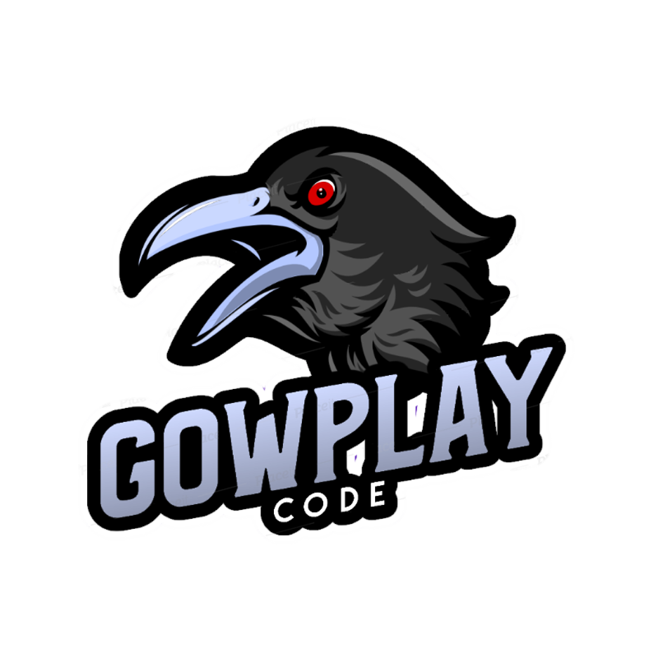

# Codigo-CRUD_2021 

<h3>Codigo del curso CRUD_2021</h3>

En este curso realizaremos un CRUD haciendo uso de NodeJS, dentro del cual validamos el inicio de sesión y procesamos los respectivos registros y procedimientos para nuestra base de datos.

Recursos:
https://github.com/GowPlay/plantilla_crud_2021

Curso de Npm: https://youtu.be/EBJCXGt1A7c

En los próximos cursos partiremos desde este ejercicio y nos centraremos específicamente en el Back-end de nuestra aplicación, realizando:

-Validaciones, Carga de archivos, Generación de documentos, seguridad y buenas practicas

Entre otros, espero te sea de gran utilidad este contenido.
y si generas una donación al canal no caería nada mal, con el fin de poder ir creando mas contenido y con una mejor calidad.

## Redes sociales

## Pasos de isntalacion 

♦ Debes de crear una cuenta en: https://www.clever-cloud.com/en/

> si lo haces por medio de la clonacion del repositorio o descarga en .zip unicamente ejecuta

 > npm i 
 para instalar los modulos necesarios

 > hacer uso de las credenciales dadas por Clever-cloud 

 > npm run dev 
 para ejecutar el server 
